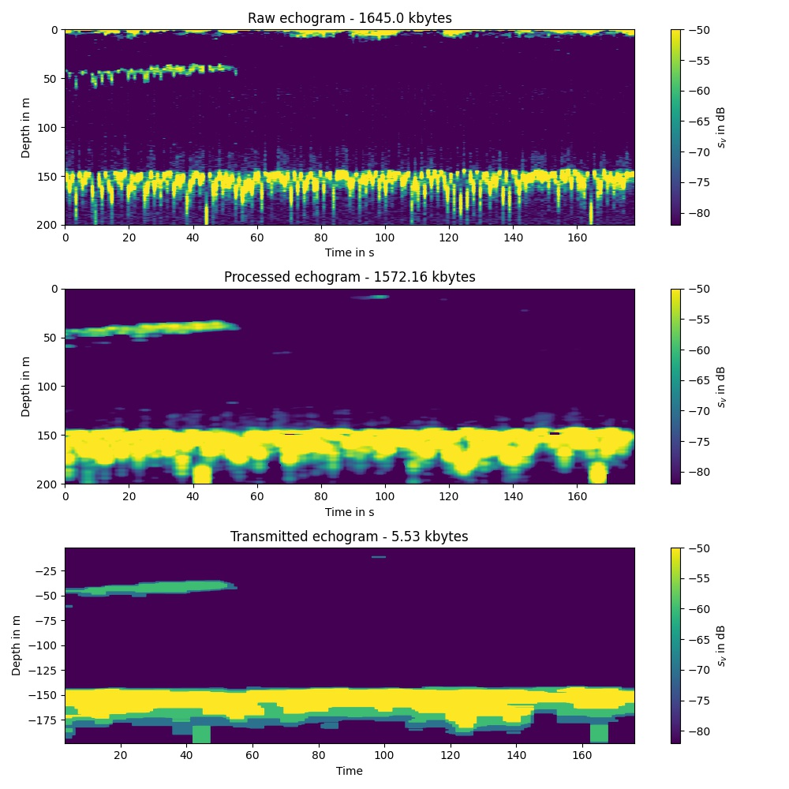
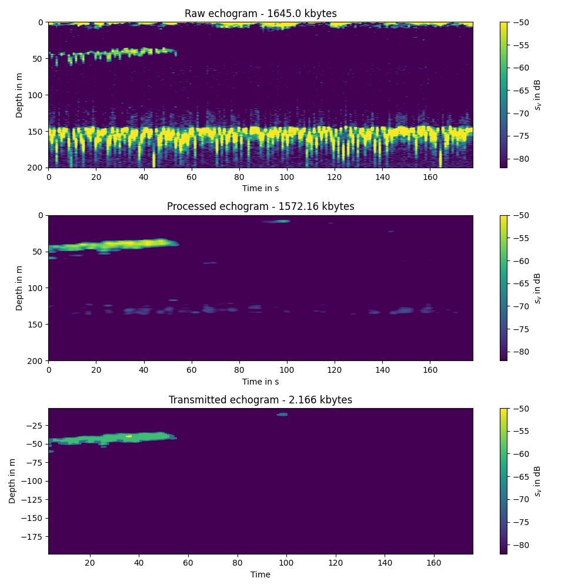

# Processing EK80 echograms with python and extracting krill swarm outlines 

This python scripts runs over a set of .raw files, reads the echograms and removes noise from faulty pings, the sea floor and range dependent noise. Than I am using the "cv2.findContours" function (https://opencv.org/) to outline regions (krill swarms) in the echograms with a backscatter higher than -70 dB. These contour lines are compressed to the shorted possible length.

When the patches are large enough (>10 pixels) I store the outlines as 16 bit floating point numbers in a .pkl file, that can than be send via Iridium or the like. The contours are saves as python list in this format:

```
   contourdict= {"id":[],"sv":[],"time_s":[],"depth_m":[],"timelimits":[],"depthlimits":[]}  
```

Here is an example:

```
{'id': [0, 1, 2],
 'sv': [-70, -70, -70],
 'time_s': [array([150.5, 151.5, 151.5, 155.5, 155.5, 150.5], dtype=float16),
  array([70.6 , 71.6 , 75.75, 76.75, 78.8 , 79.8 , 79.8 , 80.9 , 80.9 ,
         79.8 , 79.8 , 78.8 , 77.8 , 73.7 , 73.7 , 71.6 , 71.6 , 70.6 ],
        dtype=float16),
  array([3.082, 9.22 , 9.22 , 3.082], dtype=float16)],
 'depth_m': [array([-10.23 , -10.055,  -9.71 ,  -9.71 , -10.91 , -10.91 ],
        dtype=float16),
  array([ -9.2  ,  -9.03 ,  -9.03 ,  -9.2  ,  -9.2  ,  -9.375,  -9.71 ,
          -9.88 , -11.586, -11.76 , -12.445, -12.445, -12.61 , -12.61 ,
         -12.1  , -11.76 , -11.42 , -11.25 ], dtype=float16),
  array([ -9.71,  -9.71, -10.91, -10.91], dtype=float16)],
 'timelimits': [3.082, 295.759],
 'depthlimits': [-198.555036357241, -1.7043350760278198]}
```

To reconstruct an echogram from the compressed contour lines, use this script:

```python
file=r"C:\Users\a5278\Documents\postdoc_krill\krillswarm_contour_algorithm\SB_KRILL_2019-Phase0-D20210305-T025029-0.pkl"

contourdict = pickle.load( open( file, "rb" ) )

ax=plt.subplot(313)

   plt.imshow([[0,0]],aspect='auto')
   cmap = matplotlib.cm.get_cmap('viridis')
   for i_patch in contourdict['id']:
        time_s=contourdict['time_s'][i_patch]
        depth_m=contourdict['depth_m'][i_patch]
        
        svval=contourdict['sv'][i_patch]
        svval=(svval - clim[0])/ (clim[1] - clim[0])
        rgba = cmap(svval)      
        plt.fill(time_s,depth_m,color=rgba)
   plt.ylim(contourdict['depthlimits'])
   plt.xlim(contourdict['timelimits'])   
   ax.set_facecolor(cmap(0) )
   plt.clim(clim)
    
   plt.colorbar(label='$s_v$ in dB')
   plt.xlabel('Time')
   plt.ylabel('Depth in m')

```

Here is an example comparing the raw and compressed echogram with a seabed removal agorithm and without:






