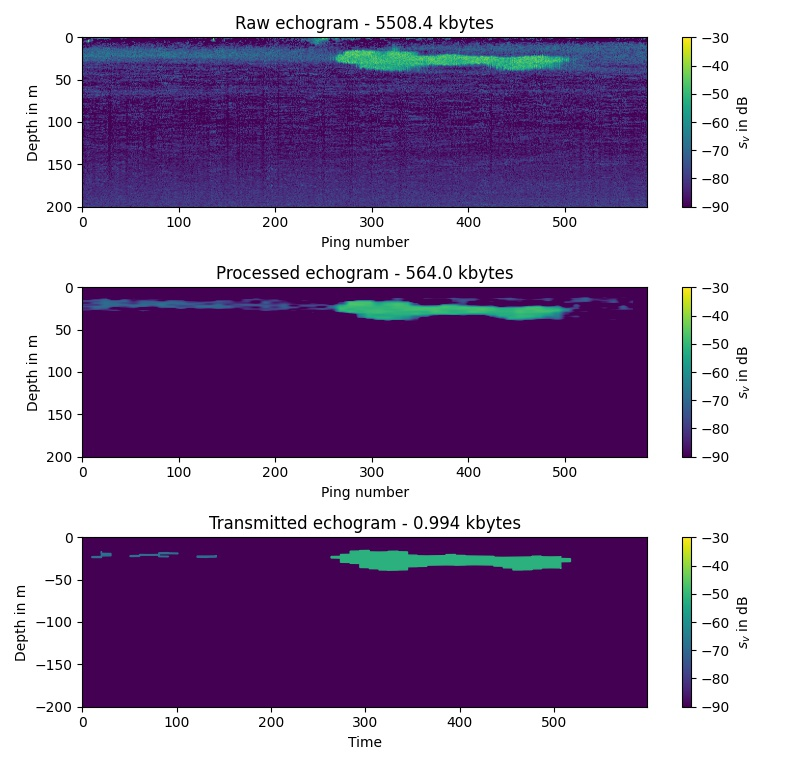
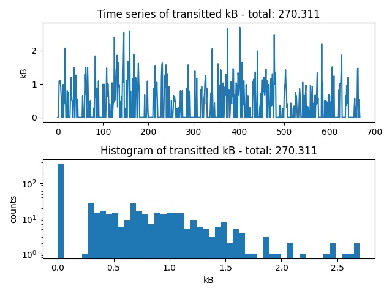
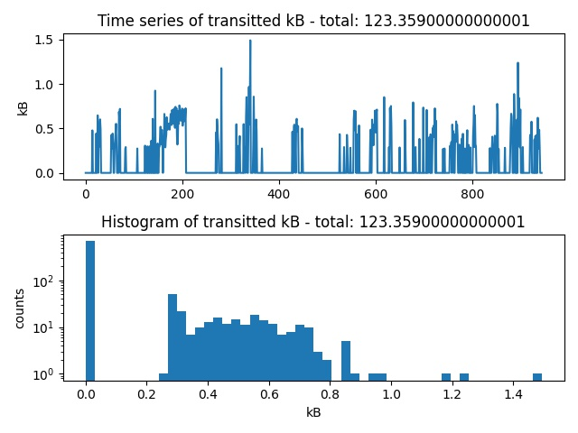

# Processing EK80 echograms with python and extracting krill swarm outlines 

This python scripts runs over a set of .raw files, reads the echograms and removes noise from faulty pings, the sea floor and range dependent noise. Than I am using the "cv2.findContours" function (https://opencv.org/) to outline regions (krill swarms) in the echograms with a backscatter higher than -70 dB. These contour lines are compressed to the shorted possible length.

When the patches are large enough (>10 pixels) I store the outlines as 16 bit floating point numbers in a .pkl file, that can than be send via Iridium or the like. The contours are saves as python list in this format:

```
clist=[countour_timespan_s,countour_depthspan_m,countour_id,countour_value,countour_time,countour_f]
```

Here is an example:

```
[178.0,
 200.1,
 [0],
 [-63.7],
 [[array([  0.  ,  10.47,  10.47,  20.94,  20.94,  31.4 ,  31.4 ,  41.88,
           52.34,  52.34,  52.34,  62.8 ,  73.3 ,  73.3 ,  83.75,  94.25,
          104.7 , 115.2 , 125.6 , 136.1 , 146.6 , 167.5 , 167.5 , 157.  ,
          157.  , 167.5 , 167.5 , 167.5 , 157.  , 146.6 , 146.6 , 146.6 ,
          125.6 , 125.6 , 115.2 , 104.7 , 104.7 , 115.2 , 125.6 , 125.6 ,
          125.6 , 115.2 , 115.2 , 115.2 , 104.7 ,  94.25,  94.25,  83.75,
           83.75,  83.75,  73.3 ,  73.3 ,  73.3 ,  83.75,  94.25,  94.25,
           83.75,  83.75,  73.3 ,  73.3 ,  62.8 ,  52.34,  52.34,  52.34,
           41.88,  41.88,  31.4 ,  20.94,  20.94,  31.4 ,  31.4 ,  20.94,
           20.94,  20.94,  10.47,   0.  ,   0.  ], dtype=float16)]],
 [[array([-12.1  , -11.93 , -12.445, -12.61 , -14.484, -14.66 , -17.05 ,
          -17.22 , -17.05 , -12.27 , -13.3  , -13.46 , -13.3  , -11.93 ,
          -11.93 , -12.1  , -12.1  , -11.93 , -11.93 , -12.1  , -11.93 ,
          -11.93 , -30.84 , -31.02 , -32.22 , -32.38 , -38.2  , -34.78 ,
          -34.6  , -34.78 , -40.22 , -38.84 , -38.53 , -37.84 , -37.66 ,
          -37.84 , -41.4  , -41.6  , -41.4  , -40.4  , -45.   , -45.16 ,
          -46.34 , -42.94 , -42.78 , -42.94 , -49.78 , -49.94 , -51.47 ,
          -44.3  , -44.16 , -42.28 , -43.8  , -43.97 , -43.8  , -42.1  ,
          -41.94 , -40.72 , -40.56 , -35.28 , -35.1  , -35.28 , -44.8  ,
          -41.25 , -41.06 , -39.03 , -38.84 , -39.03 , -41.4  , -41.6  ,
          -50.28 , -50.44 , -52.16 , -40.4  , -40.22 , -40.4  , -40.56 ],
         dtype=float16)]]]
```

To reconstruct an echogram from the compressed contour lines, use this script:

```python
file=r"C:\Users\a5278\Documents\postdoc_krill\krillswarm_contour_algorithm\SB_KRILL_2019-Phase0-D20210305-T025029-0.pkl"

clist = pickle.load( open( file, "rb" ) )

plt.figure(0)
plt.clf()    
  
ax=plt.subplot(111)
plt.imshow([[0,0]])
cmap = matplotlib.cm.get_cmap('viridis')
for i_patch in clist[2]:
    time_s=clist[4][i_patch][0]
    depth_m=clist[5][i_patch][0]
    
    svval=clist[3][i_patch]
    svval=(svval + 90)/ (-30+90)
    rgba = cmap(svval)      
    plt.fill(time_s,depth_m,color=rgba)
plt.ylim([-clist[1],0])
plt.xlim([0,clist[0]])   
ax.set_facecolor(cmap(0) )
plt.clim([-90,-30])

plt.colorbar(label='$s_v$ in dB')
plt.xlabel('Time')
plt.ylabel('Depth in m')

plt.tight_layout()
```

Here is an example comparing the raw and compressed echogram:



Here are some stats for the 2020 and 2021 dataset:






